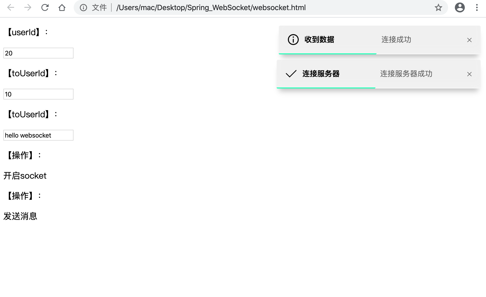

# [Spring_WebSocket](https://github.com/ME-liuchunfu/Spring_WebSocket)

#### 简介

~~~text
Spring_WebSocket一个前端的websocket插件集成了iziToast提示插件，使用事件监听的方式简化websocket管理，可对参数进行配置，简化底层操作
~~~

#### 使用方式

~~~text
第一步导入项目
https://github.com/ME-liuchunfu/Spring_WebSocket
将项目引入到自己的项目当中，其中使用到的数据主要包含以下几点：
js    ---  核心Spring_WebSocket.js
plugin  --- iziToast 插件依赖（可以自行配置）
websocket.html  --- 用例案例

第二步实例化
var socket = null;
var option = {
            iziToastUrl: {
                css: `plugin/iziToast/css/iziToast.min.css`,
                js: `plugin/iziToast/js/iziToast.min.js`
            },
            log: true, 
            url: 'ws://localhost:9999/demo/imserver/'+$("#userId").val(),
            beforeSend: function(data){
                //this.showTip('info', {title: '准备发送数据', message: '发送的数据'});
            },
            afterSend: function(data){
                this.showTip('success', {title: '发送数据成功', message: '数据发送成功'});
            },
            open: function(data){
                console.log('open', data.type, this);
                this.Spring_WebSocket.showTip('success', {title: '连接服务器', message: '连接服务器成功'});
            },
            message: function(msg){
                console.log('message,收到消息：', msg.data, this);
                if(msg.data.indexOf("{") != -1){
                    let text = JSON.parse(msg.data);
                this.Spring_WebSocket.showTip('info', {title: '收到数据', message: `来自${text.fromUserId}：${text.contentText}`});
                }else{
                    this.Spring_WebSocket.showTip('info', {title: '收到数据', message: msg.data});
                }
                
            },
            error: function(data){
                console.log('error', data, this);
                this.Spring_WebSocket.showTip('error', {title: '错误！！', message: '发生错误'});
            },
            close: function(){
                console.log('close', data, this);
                this.Spring_WebSocket.showTip('warning', {title: '连接关闭', message: '已经和服务器断开连接'});
            },
            tip: {
                showTip: true,
                maxSize: 10,
                customTip: {
                    class: 'test',
                    color: 'dark',
                    title: 'Hello!',
                    message: 'Do you like it?',
                    position: 'topRight',//'topCenter',
                    transitionIn: 'flipInX',
                    transitionOut: 'flipOutX',
                    progressBarColor: 'rgb(0, 255, 184)',
                    imageWidth: 70,
                    onClose: function(){
                        socket.showTip('info',{title: '关闭了', message: '消息关闭'});
                    },
                    iconColor: 'rgb(0, 255, 184)'
                }
            }
            
        };
socket = new Spring_WebSocket(option);

// 主动发送数据
socket.send('需要发送的内容');
~~~

#### 函数简述&配置简述

~~~text
1.插件配置
iziToastUrl: {
    css: `plugin/iziToast/css/iziToast.min.css`,//css文件
    js: `plugin/iziToast/js/iziToast.min.js`//js文件
},

2.配置是否打印日志
log: true, // true: 打印， false： 不打印

3.websocket长连接通讯地址
url: 'ws://localhost:9999/demo/imserver/' // 服务器通讯地址

4.beforeSend消息发送前监听
beforeSend: function(data){
	// data: 发送的数据
}

5.afterSend消息发送完成后监听
afterSend: function(data){
	// data: 发送的数据
}

6.open长连接是的周期函数,wesocket.onopen的回调
open: function(data){
	// data: 长连接数据
}

7.message长连接是的周期函数，wesocket.onmessage的回调
message: function(msg){
	// msg: 服务器推送的消息数据
}

8.error长连接是的周期函数，wesocket.onerror的回调
error: function(data){
	// data: 发生错误的数据
}

9.close长连接是的周期函数，wesocket.onclose的回调
close: function(){
}

10.tip消息提示配置
	showTip: true, 显示消息推送
	maxSize: 10, 消息数字最大个数
~~~

#### 运行效果

#### 